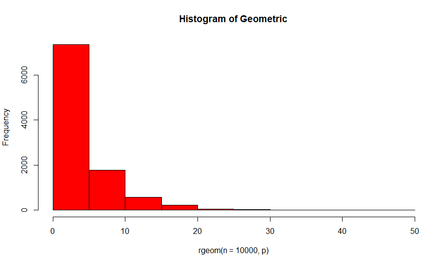
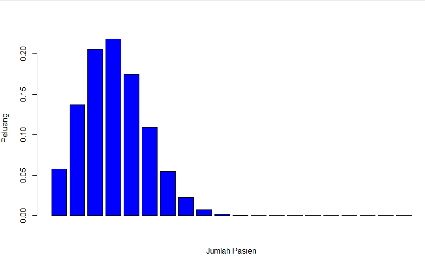
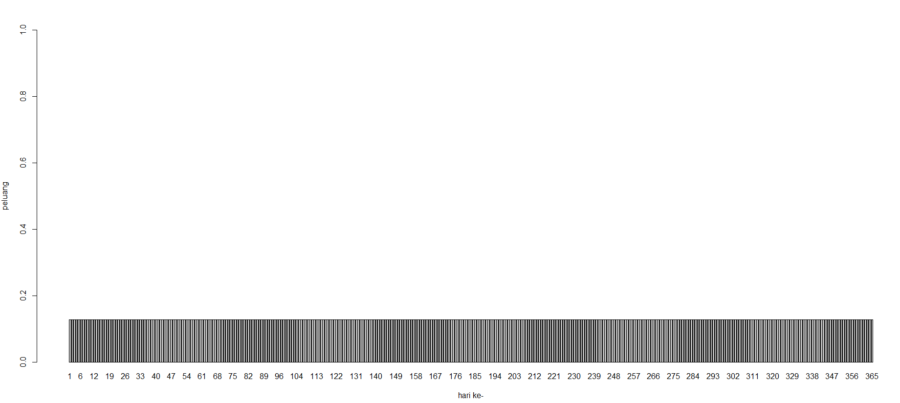
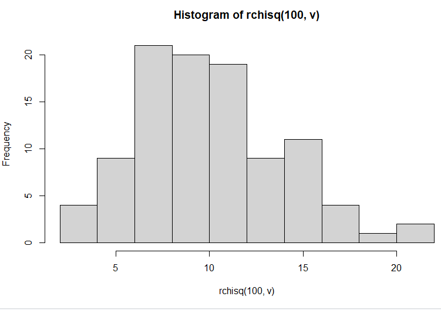
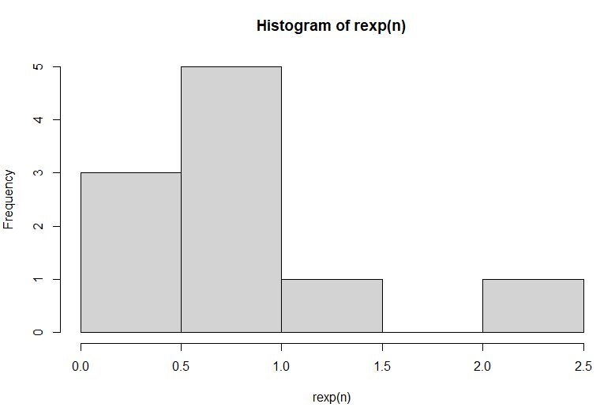
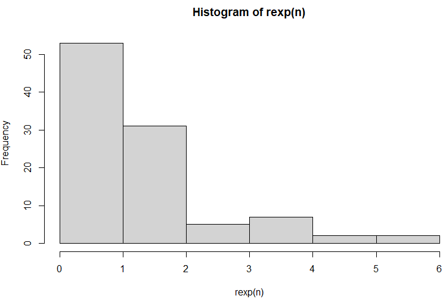
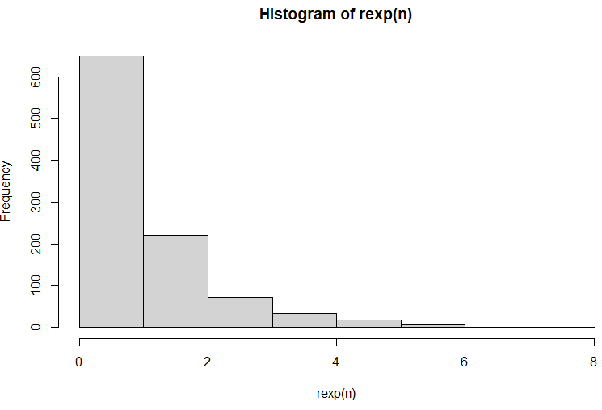
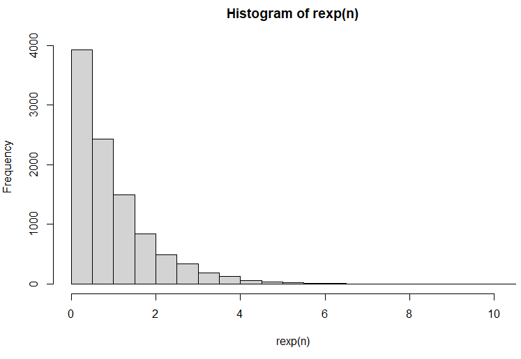

# P1_Probstat_B_5025201062
<h2>Praktikum Modul 1 Probstat Kelas B</h2>
Nama: Pierra Muhammad Shobr<br>
NRP: 5025201062

<h3>1.</h3>
1.a <br>
peluang penyurvei bertemu x = 3 orang yang tidak menghadiri acara vaksinasi sebelum keberhasilan pertama ketika p = 0,20 dari populasi menghadiri acara vaksinasi<br>

```c
n = 3
p = 0.2
dgeom(n,p)
```

1.b<br>
mean Distribusi Geometrik dengan 10000 data random , prob = 0.20 , X = 3 <br>

```c
mean(rgeom(n = 10000, p) == 3)
```

1.c<br>
Bandingkan Hasil poin a dan b<br>
pada soal a dan b terjadi perbedaan yang tidak terlalu jauh, akan tetapi nilai dari b adalah nilai random yang hasilnya ditentukan oleh nilai x, sedangkan a selalu bernilai tetap <br>

1.d<br>
Histogram Distribusi Geometri
```c
hist(rgeom(n = 10000, p), main="Histogram of Geometric", col="red")
```


1.e<br>
Nilai Rataan (μ) dan Varian (σ²)
```c
rataan = 1/p
paste("nilai rataan: ", rataan)
varian = (1-p)/p^2
paste("nilai varian: ", varian)
```

<h3>2.</h3>
2.a<br>
Peluang terdapat 4 pasien yang sembuh
```c
S = 20
p = 0.2
q = 1-p

#2a
n = 4
dbinom(n, S, p)
```

2.b<br>
Gambarkan grafik histogram
```c
barplot(dbinom(1:20,S, p), col = "blue")
```


2.c<br>
Nilai Rataan (μ) dan Varian (σ²)
```c
rataan = n * p
paste("rataan: ", rataan)

varian = n * p *q
paste("varian: ", varian)
```
<h3>3.</h3>
rata-rata historis = 4,5<br><br>
3.a   Berapa peluang bahwa 6 bayi akan lahir di rumah sakit ini besok<br>
```c
mean_historis = 4.5

#3a
n = 6
dpois(n, mean_historis)
```

3.b   histogram kelahiran 6 bayi akan lahir dalam satu tahun<br>
```c
peluang = dpois(n, mean_historis)
data = data.frame(y=c(peluang), x=c(1:365))
barplot(data$y, names.arg=data$x, ylab="peluang", xlab="hari ke-", ylim=0:1)
```


3.c   bandingkan hasil poin a dan b<br>
nilai dari soal 3a dan 3b cenderung sama disetiap hari<br>

3.d<br>
Rataan (μ) dan Varian (σ²)<br>
```c
lamda = mean_historis
rataan = varian = lamda
```

<h3>4.</h3>
4.a   Fungsi Probabilitas dari Distribusi Chi-Square<br>

```c
x = 2
v = 10
dchisq(x, v)
```


4.b   Histogram dari Distribusi Chi-Square dengan 100 data random<br>
```c
hist(rchisq(100, v))
```


4.c   Rataan (μ) dan Varian (σ²)<br>
```c
rataan = v
paste("rataan: ", rataan)
varian = 2 * v
paste("varian: ", varian)
```

<h3>5.</h3>
(λ = 3)
5.a Fungsi Probabilitas dari Distribusi Exponensial<br>
```c
lambda = 3

#5a
dexp(lambda)
```
5.b Histogram dari Distribusi Exponensial untuk 10, 100, 1000 dan 10000 bilangan random
```c
n = 10
hist(rexp(n))
n = 100
hist(rexp(n))
n = 1000
hist(rexp(n))
n = 10000
hist(rexp(n))
```
n = 10

n = 100

n = 1000

n = 10000

<h3>6.</h3>
